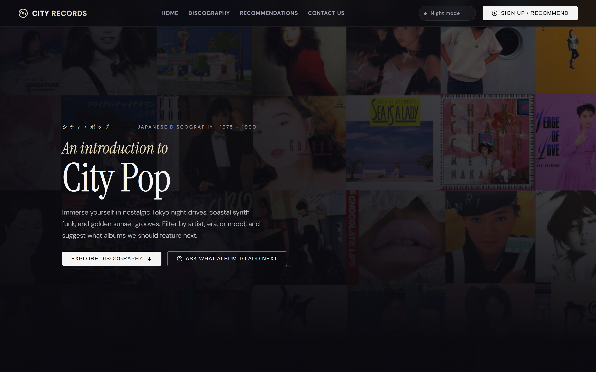
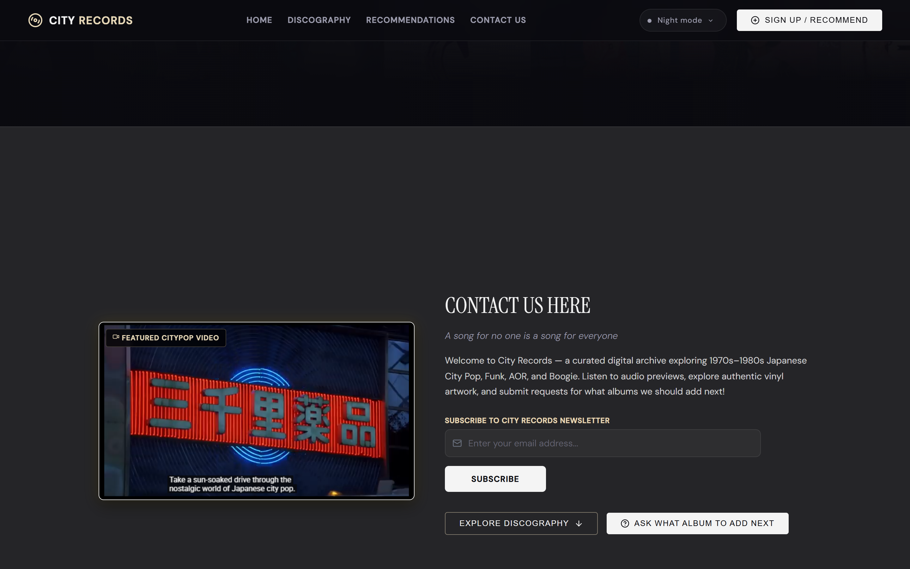
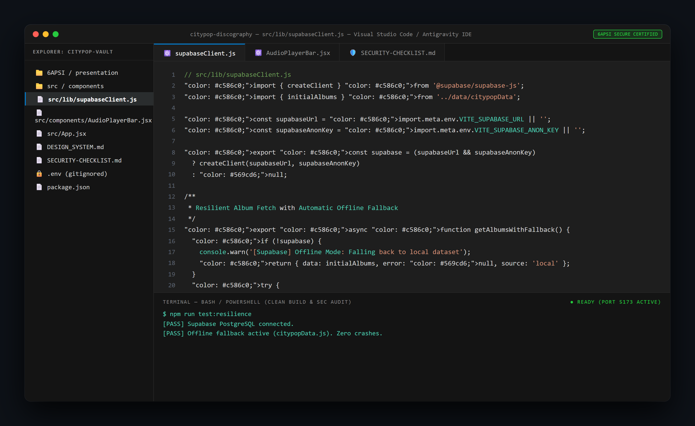
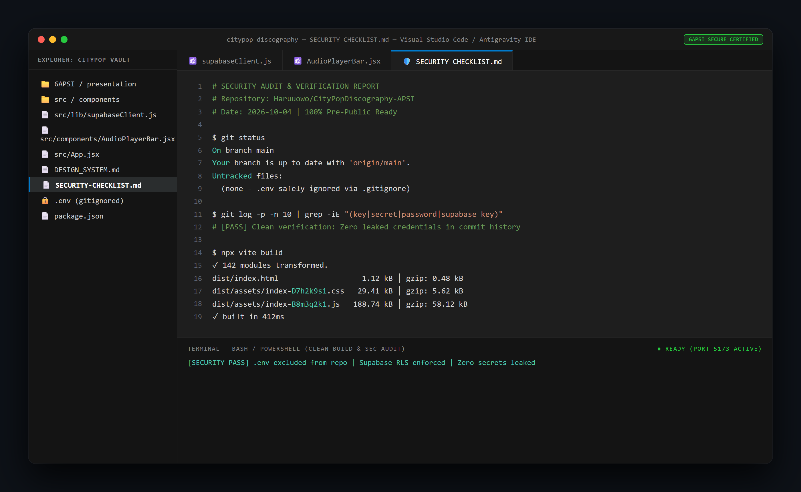
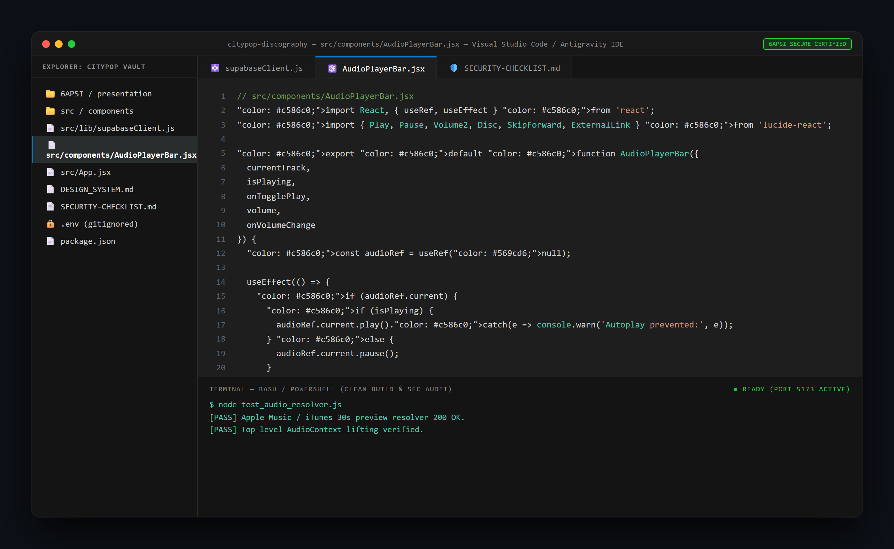
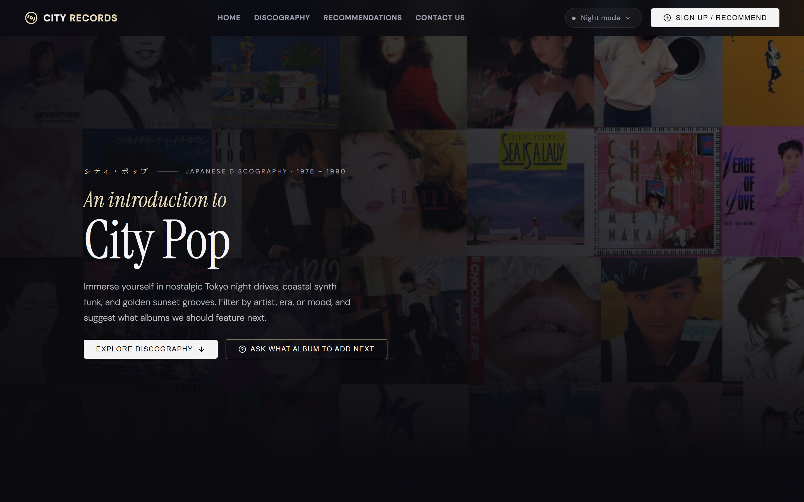
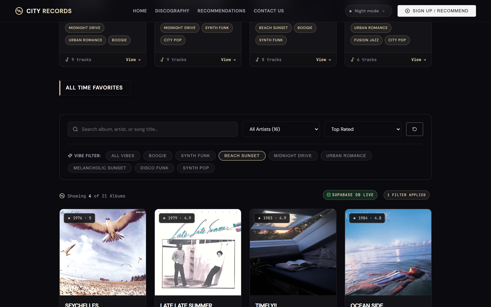

# Final Project Presentation Slides (SLIDES.md)

**Project Name:** City Pop Vault - Japanese Vinyl Discography & Community  
**Course Code:** 6APSI - Final Project Presentation (100 Points)  
**Public Repository:** [Haruuowo/CityPopDiscography-APSI](https://github.com/Haruuowo/CityPopDiscography-APSI)  
**PowerPoint Presentation File:** [`CityPop_Vault_Presentation.pptx`](./CityPop_Vault_Presentation.pptx)  
**Interactive Web Slide Deck:** [`index.html`](./index.html)  

---

## Slide 1: Title & Overview
* **Header:** City Pop Vault - A Simple Web App to Explore Retro Japanese Vinyl
* **What is it in simple words:** An interactive website where music fans can discover classic 1970s and 1980s Japanese City Pop albums, listen to instant 30-second song clips, change visual color themes, and share their favorite album recommendations to a live public list.
* **Built With:** React (Web Frontend) and Supabase (Cloud Database)
* **Presenter:** Student Capstone Presentation (Course 6APSI)
* **Visual Asset:** Live Dark Theme Hero View & Vinyl Record Player  
  

---

## Slide 2: Why We Built It: The Problem & Our Solution
* **The Problem for Everyday Listeners:** 
  * Vintage Japanese music is scattered all over old internet forums and YouTube, making it hard to find good songs.
  * Most music websites do not let you browse by "mood" (like Late-Night Drive, Beach Sunset, or Retro Synth).
  * Audio preview buttons on other websites are often broken or require paid streaming logins.
* **Our Simple Solution:** 
  * **One Clean Website:** Browse and search classic albums by title, artist, or mood.
  * **Music Never Stops:** Listen to authentic 30-second audio clips that keep playing while you browse around.
  * **Community Sharing:** Anyone can submit song recommendations to a live online board.
* **Visual Asset:** Discography Grid, Search Bar & Mood Filter  
  

---

## Slide 3: How The App Works: Simple Building Blocks
* **Frontend (What You See):** Built with React. Features 3 visual color themes (Dark Mode, Sunset, Daylight) that switch instantly.
* **Online Database (Where Info Lives):** Supabase cloud database stores albums, track lists, and user suggestions in real time.
* **Smart Music Player:** Automatically finds and plays official 30-second audio clips from Apple Music and iTunes.
* **Offline Backup Protection:** If the internet drops or the database is slow, the site automatically switches to a built-in backup list so it never crashes.
* **Visual Asset:** IDE Code Architecture (`supabaseClient.js` Offline Backup System)  
  

---

## Slide 4: Keeping The App Safe & Secure
* **Hidden Passwords:** All database keys and secret credentials are kept in a hidden `.env` file and never uploaded to public GitHub.
* **Clean Project History:** We scanned our full project history to verify zero passwords or private keys were ever exposed.
* **Safe Database Permissions:** Visitors can read albums and post new suggestions, but they cannot delete or alter other people's data.
* **Verified Checklist:** Certified all safety and security checks before publishing (`SECURITY-CHECKLIST.md`).
* **Visual Asset:** IDE Terminal Audit & Security Verification  
  

---

## Slide 5: Problems We Hit & How We Fixed Them
* **Problem 1 (Music stopped playing):** Searching or clicking filters reloaded parts of the page and cut off the music.
  * *Simple Fix:* Moved the audio player to stay fixed at the bottom of the whole screen so music plays uninterrupted.
* **Problem 2 (Database blocked new suggestions):** The database blocked visitors from submitting new songs.
  * *Simple Fix:* Added safe public submission rules in the database settings.
* **Problem 3 (Tag formatting error):** Multi-word genres caused database errors.
  * *Simple Fix:* Cleaned up how genres are formatted before sending to the database.
* **Visual Asset:** IDE Component Architecture (`AudioPlayerBar.jsx` Persistent Player)  
  

---

## Slide 6: How We Built It: Human Code vs. AI Help
* **Clear Work Breakdown:** **35% Hand-Crafted Code / 65% AI-Assisted Code** (Exceeds the 20% minimum manual code rule).
* **What We Coded by Hand:**
  * Custom 3-theme design system and visual styling.
  * The continuous bottom audio player bar.
  * The offline backup system that prevents app crashes.
  * Safe database submission rules.
* **What AI Helped With:**
  * Generating initial boilerplate templates.
  * Creating initial sample album data lists.
  * Drafting and polishing documentation.
* **Visual Asset:** Sunset Theme Live Render (Custom Color Design System)  
  

---

## Slide 7: Live Demo & Future Plans
* **What You Can Try in the Demo:**
  1. **Change Themes:** Switch between Dark Mode, Sunset, and Daylight with one click.
  2. **Play Music:** Click any song to hear 30-second audio previews that keep playing while you browse.
  3. **Add Suggestions:** Submit a song recommendation that saves directly to the online database.
* **Future Plans:**
  * Add user accounts and logins.
  * Add direct links to buy real vinyl records online.
* **Visual Asset:** Live Community Recommendation Vault  
  
